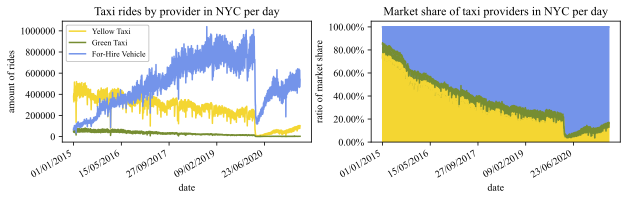
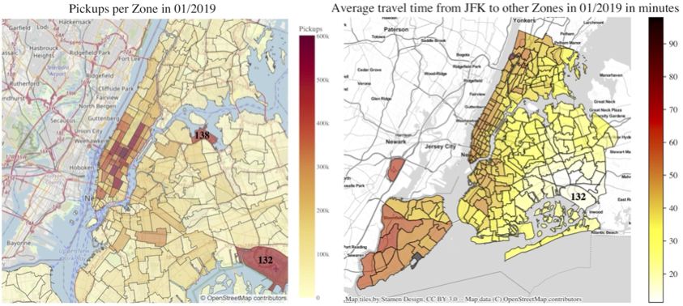
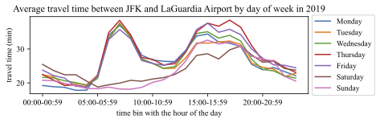
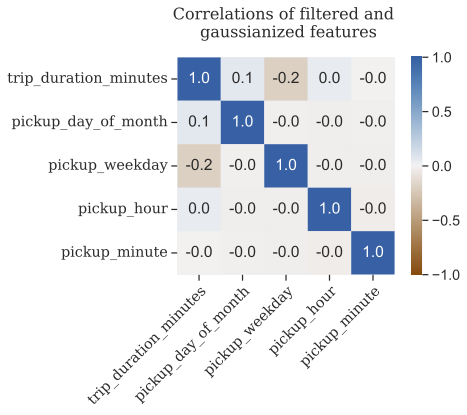
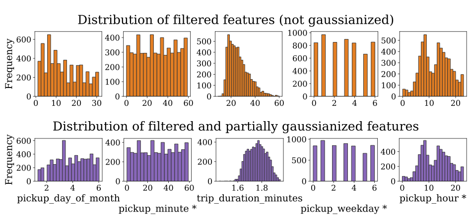

# Analysing Taxi Data for Traffic Planning and Tourism

We used a collection of New York City taxi trip records to identify and visualisepopular locations as well as the development of market shares of different types oftaxi companies. Furthermore, we wanted to predict how much longer rides takedepending on the time of the day in comparison to the shortest possible journeyduration. To answer this question, we wanted to use linear regression. However,during our analyses, we found many inconsistencies in the data and the absence ofcorrelation between the destined temporal predictors and the trip duration.

## Installation

Use the package manager [pip](https://pip.pypa.io/en/stable/) to install the requirements.

```bash
pip install -r requirements.txt
```

## Usage

Use the programming language [python](https://www.python.org/downloads/) to generate the figures. (Note: To generate taxi-rides-over-time.pdf, about 110 gigabytes of hard disk space have to be available. For the other plots, about 2 GB of space are required and the download might take up to 10 minutes.)

```python3 exp/fig_<name>```

## Example figures









